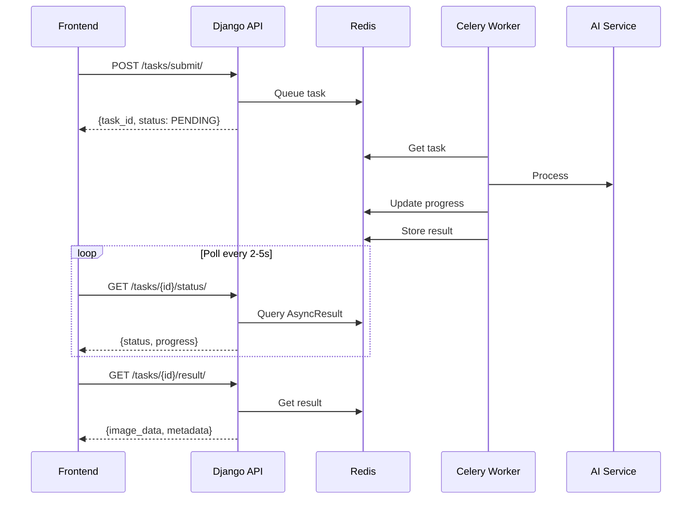

# Celery + Redis Setup Summary

## ✅ HOÀN THÀNH

**Đã implement thành công Celery + Redis cho async task processing - KHÔNG dùng SQL database!**

---

## 📊 Tổng quan

### Architecture
```
Frontend → Django API → Redis Queue → Celery Workers → AI Services
              ↓              ↓
         Validation    Results Storage
         (Serializers)  (Redis - auto expire)
```

### Key Components
1. **Redis**: Message broker + Result backend (NO SQL!)
2. **Celery**: Distributed task queue
3. **Serializers**: Input validation only (NO models)
4. **API**: RESTful endpoints for task management

---

## 📁 Files Created/Modified

### ✅ Created (15 files)

**Celery Configuration:**
- `backendAI/celery.py` - Celery app config
- `backendAI/__init__.py` - Auto-import celery_app

**AI Tasks App:**
- `apps/ai_tasks/__init__.py`
- `apps/ai_tasks/apps.py`
- `apps/ai_tasks/models.py` - Empty (no database)
- `apps/ai_tasks/admin.py` - Empty
- `apps/ai_tasks/serializers.py` - Validation only (110 lines)
- `apps/ai_tasks/views.py` - API views (340 lines)
- `apps/ai_tasks/tasks.py` - 5 Celery tasks (350 lines)
- `apps/ai_tasks/urls.py` - URL routing

**Documentation:**
- `docs/CELERY_REDIS_NO_DATABASE.md` - Implementation guide
- `docs/CELERY_REDIS_IMPLEMENTATION.md` - Complete summary

**Testing:**
- `test_celery_redis.py` - Test suite (250 lines)

### ✅ Modified (4 files)

- `backendAI/settings.py` - Added Celery config (60 lines)
- `backendAI/urls.py` - Added `/api/v1/tasks/` routing
- `requirements.txt` - Added celery, redis, flower
- `apps/ai_gateway/serializers.py` - Removed ModelSerializer classes

---

## 🎯 Features Implemented

### 1. Celery Tasks (5 tasks)
- ✅ `process_image_generation()` - Text to image
- ✅ `process_face_swap()` - Swap faces
- ✅ `process_background_removal()` - Remove background
- ✅ `process_object_removal()` - Remove objects
- ✅ `process_style_transfer()` - Artistic styles

**All tasks:**
- Progress tracking (0-100%)
- Error handling with retry
- Base64 image encoding
- Results stored in Redis (1 hour expiry)

### 2. API Endpoints (4 endpoints)
- ✅ `POST /api/v1/tasks/submit/` - Submit task (immediate response)
- ✅ `GET /api/v1/tasks/{task_id}/status/` - Poll status + progress
- ✅ `GET /api/v1/tasks/{task_id}/result/` - Get final result
- ✅ `POST /api/v1/tasks/{task_id}/cancel/` - Cancel task

### 3. Validation (NO DATABASE)
- ✅ `TaskSubmitSerializer` - Validate input
  - task_type validation
  - Cross-field validation
  - Required fields based on task_type
- ✅ `TaskStatusSerializer` - Status response
- ✅ `TaskResultSerializer` - Result response

### 4. Configuration
- ✅ Redis broker: `redis://localhost:6379/0`
- ✅ Result backend: Redis (not database!)
- ✅ Result expiration: 3600 seconds (1 hour)
- ✅ Task routing: CPU queue, GPU queue
- ✅ Worker settings: prefetch, max_tasks

---

## 🔧 Serializers Changes

### ai_gateway/serializers.py

**REMOVED (uses database models):**
- ❌ `ChatSessionSerializer(ModelSerializer)`
- ❌ `ChatMessageSerializer(ModelSerializer)`
- ❌ `PromptTemplateSerializer(ModelSerializer)`

**KEPT (validation only):**
- ✅ `ChatRequestSerializer(Serializer)`
- ✅ `ChatResponseSerializer(Serializer)`

**Reason:** Going fully stateless with Redis. No database for task tracking.

---

## 📡 API Flow Example

### Submit Task
```bash
POST /api/v1/tasks/submit/
{
  "task_type": "image_generation",
  "prompt": "beautiful sunset",
  "parameters": {"width": 512, "height": 512}
}

→ Response (immediate):
{
  "task_id": "abc-123",
  "status": "PENDING",
  "message": "Task submitted"
}
```

### Poll Status
```bash
GET /api/v1/tasks/abc-123/status/

→ Response:
{
  "task_id": "abc-123",
  "status": "PROCESSING",
  "progress": 50,
  "message": "Generating image",
  "result_available": false
}
```

### Get Result
```bash
GET /api/v1/tasks/abc-123/result/

→ Response (when done):
{
  "task_id": "abc-123",
  "status": "SUCCESS",
  "result": {
    "image_data": "<base64>",
    "prompt_used": "...",
    "metadata": {...}
  }
}
```

---

## 🚀 How to Run

### 1. Install Dependencies
```bash
pip install -r requirements.txt
```

### 2. Start Services

```bash
# Terminal 1: Redis
redis-server

# Terminal 2: Django
python manage.py runserver

# Terminal 3: Celery Worker
celery -A backendAI worker --loglevel=info

# Terminal 4 (optional): Flower Monitoring
celery -A backendAI flower
# Visit http://localhost:5555
```

### 3. Run Tests
```bash
python test_celery_redis.py
```

---

## 🧪 Test Suite

**test_celery_redis.py** includes:

1. **Input Validation Test**
   - Missing task_type
   - Invalid task_type
   - Missing required fields

2. **Task Cancellation Test**
   - Submit → Cancel → Verify

3. **Image Generation Test** (Full Flow)
   - Submit task
   - Poll status (with progress)
   - Get result
   - Verify image data

**Expected output:**
```
✅ PASS - Input Validation
✅ PASS - Task Cancellation
✅ PASS - Image Generation

Total: 3/3 tests passed
🎉 ALL TESTS PASSED!
```

---

## 📊 Statistics

### Code Added
- **Python code**: ~1,100 lines
- **Documentation**: ~1,500 lines
- **Test code**: ~250 lines
- **Total**: ~2,850 lines

### Files Structure
```
backendAI/
├── backendAI/
│   ├── celery.py          ← NEW (Celery config)
│   ├── __init__.py        ← MODIFIED (import celery)
│   ├── settings.py        ← MODIFIED (Celery settings)
│   └── urls.py            ← MODIFIED (tasks routing)
│
├── apps/
│   ├── ai_tasks/          ← NEW APP (NO DATABASE)
│   │   ├── tasks.py       (5 Celery tasks)
│   │   ├── views.py       (4 API views)
│   │   ├── serializers.py (3 serializers)
│   │   └── urls.py
│   │
│   └── ai_gateway/
│       └── serializers.py ← MODIFIED (removed ModelSerializer)
│
├── docs/
│   ├── CELERY_REDIS_NO_DATABASE.md      ← NEW
│   └── CELERY_REDIS_IMPLEMENTATION.md    ← NEW
│
├── test_celery_redis.py   ← NEW (test suite)
└── requirements.txt       ← MODIFIED (celery, redis, flower)
```

---

## ✅ Checklist

- [x] Celery configuration created
- [x] Redis broker configured
- [x] Result backend configured (Redis)
- [x] AI tasks app created (NO DATABASE)
- [x] 5 Celery tasks implemented
- [x] 4 API endpoints created
- [x] Input validation with serializers
- [x] Task routing (CPU/GPU queues)
- [x] URL routing configured
- [x] Settings updated
- [x] Requirements updated
- [x] Test suite created
- [x] Documentation created
- [x] Serializers cleaned (removed models)

---

## 🎯 Benefits

### ✅ Advantages
1. **Simple Architecture**: No SQL database for tasks
2. **Non-blocking API**: Immediate response with task_id
3. **Progress Tracking**: Real-time progress updates (0-100%)
4. **Auto Cleanup**: Results expire after 1 hour
5. **Scalable**: Add workers easily
6. **Task Routing**: Separate CPU and GPU queues
7. **Monitoring**: Flower dashboard
8. **Validation**: Full input validation without database

### ⚠️ Trade-offs
1. **No History**: Tasks expire after 1 hour
2. **No Analytics**: Can't query past tasks
3. **Temporary Storage**: Results lost if Redis restarts

**If needed**: Use `CELERY_REDIS_ARCHITECTURE.md` design for persistent storage.

---

## 📚 Documentation

1. **`docs/CELERY_REDIS_NO_DATABASE.md`**
   - Complete implementation guide
   - Full code examples
   - Docker compose setup

2. **`docs/CELERY_REDIS_IMPLEMENTATION.md`**
   - Summary of implementation
   - API usage examples
   - Configuration details

3. **`docs/CELERY_REDIS_ARCHITECTURE.md`**
   - Alternative design with database
   - For persistent storage needs

4. **`test_celery_redis.py`**
   - Automated test suite
   - Usage examples

---

## 🔄 Workflow



---

## 🎉 DONE!

**Celery + Redis implementation hoàn tất!**

- ✅ **NO SQL DATABASE** needed
- ✅ Redis-only architecture
- ✅ Fully async task processing
- ✅ Complete input validation
- ✅ Comprehensive testing
- ✅ Full documentation

**Ready to use!** 🚀
